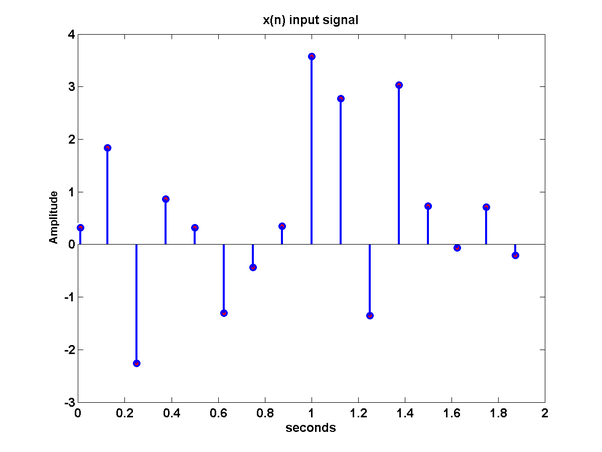

.. _Calcul.rst:

Calcul des transformées de Fourier
##################################

.. admonition:: Coefficients

    Nous définissons les coefficients comme suit:

    ..  math::

        \begin{cases}

        a_n = \frac{1}{p} \int^{p/2}_{-p/2} s(x)\cos(nx) dx\\
        b_n = \frac{1}{p} \int^{p/2}_{-p/2} s(x)\sin(nx) dx\\

        \end{cases}

    où :math:`p` est la période de la fonction. Si la fonction est apériodique, nous posons :math:`p = \infty`.

Ceci correspond à l'air du produit des fonctions durant une période. Intuitivement, il s'agit de déterminer à quel point la fonction harmonique fait partie de :math:`s(x)`, à quel point ces deux fonctions sont correlées.

Comme annoncé précédemment, nous souhaitons procéder à une simplification des coefficients afin de n'en avoir plus qu'un pour chaque fréquence.

..  warning::

    Les détails mathématiques sont donnés, mais il n'est pas utiles de les lire pour tout comprendre. Il sera cependant nécessaire de faire confiance à la méthode.

..  admonition:: Détails mathématiques
        
    Soit :math:`s(x)` une fonction réelle. Nous posons

    ..  math::

        s(x) =  \frac{a_0}{2} + \sum^\infty_{n=1} a_n\cdot \cos(nx) + b_n\cdot \sin(nx).
    
    

    Par l'identité d'Euler nous avons

    ..  math::

        e^{inx} = \cos(nx)+ i\sin(nx)

    et donc aussi

    ..  math:: 

        \cos(nx) = \frac{e^{inx}+e{-inx}}{2} \text{ et } \sin(nx) = \frac{e^{inx}-e^{-inx}}{2}.

    En insérant dans la définition de :math:`s(x)` nous obtenons 

    ..  math::

        s(x) = \frac{a_0}{2} + \sum^\infty_{n=1} \left(\frac{a_n-ib_n}{2}\right) e^{inx}+ \sum^\infty_{n=1} \left(\frac{a_n+ib_n}{2}\right) e^{-inx}.

    Maintenant nous définissons les coefficients recherchés

    ..  math::

        c_n = \frac{1}{2}(a_n + ib_n) \text{ avec } \bar{c}_n = \frac{1}{2}(a_n-ib_n).

    Ainsi l'on peut écrire, en réindexant avec :math:`-n`

    ..  math::

        s(x) = \frac{a_0}{2} + \sum^{-\infty}_{n=-1} \bar{c}_{-n}e^{-inx} + \sum^\infty_{n=1} c_ne^{-inx}

    Nous définissons de plus

    ..  math::

        c_0 = \frac{a_0}{2} \text{ et } c_n = \bar{c}_{-n}, n = -1,-2,\dots

    Ce qui nous amène au résultat désiré

    ..  math::

        s(x) = \sum^\infty_{n=-\infty} c_n e^{-inx}

    A partir de :math:`c_n = \frac{1}{2}(a_n + ib_n)` on peut arriver par des méthodes similaires à 

    ..  math::

        c_n = \frac{1}{2p}\int^p_{-p} s(x)e^{inx}dx.

    En particulier pour :math:`n=0`:

    ..  math::

        c_0 = \frac{1}{2p}\int^p_{-p}s(x)dx

Pour les flemmards qui auraient pas voulu suivre la démonstration, voici le résultat final :

..  admonition:: Série exponentielle complexe 

    Nous pouvons écrire notre fonction :math:`s(x)` sous la forme:
    
    ..  math::

        s(x) = \sum^\infty_{n=-\infty} c_n e^{-inx}

    avec

    ..  math::
        c_n = \frac{1}{2p}\int^p_{-p} s(x)e^{inx}
        

En faisant le lien avec la section précédente, nous pouvons noter en particulier que

..  math::

    \hat{f}(n) = c_n, n\in \mathbb{N}

Cette définition peut être étendue aux nombres réels, mais nous nous en tiendrons à une description qualitative durant les applications.

Transformée de Fourier discrète 
===============================

Dans la pratique, les signaux obtenus ne sont pas continus, mais des points mesurés par des outils à des intervalles de temps constants, par exemple.

L'échantillon suivant permet la visualisation des données.

    Un signal discret

La transformée de Fourier peut être réutilisée sans grandes adaptations. Il suffit de remplacer l'intégrale par une somme de Riemann approximative.

Si l'on indexe les points complexes comme :math:`x_0, x_1, \dots, x_N` alors

..  math::
    \hat{f}(n) =: X_n =\sum^{N-1}_{k=0} x_k \cdot e^{-ink}, n \in \mathbb{Z}\cap[0;N].

De façon inverse nous avons aussi:

..  math::
    x_n = \frac{1}{N} \sum^{N-1}_{k=0} X_k \cdot e^{ink}, n \in \mathbb{Z}\cap[0;N].

..  admonition:: Nombre de données
    
    Si l'on dispose de :math:`N` points, alors l'on peut calculer la transformée de Fourier pour :math:`N` fréquences, comprises entre 0 et :math:`N` (puisque que l'on ne crée pas d'information avec le spectre).

Plus le nombre de points est élevé, plus il est possible d'être précis. De plus il est interessant de noter qu'il faut alors calculer :math:`N^2` aires afin de couvrir le spectre. L'algorithme brut est donc de :math:`\mathcal{O}(n^2)`.
