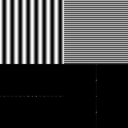
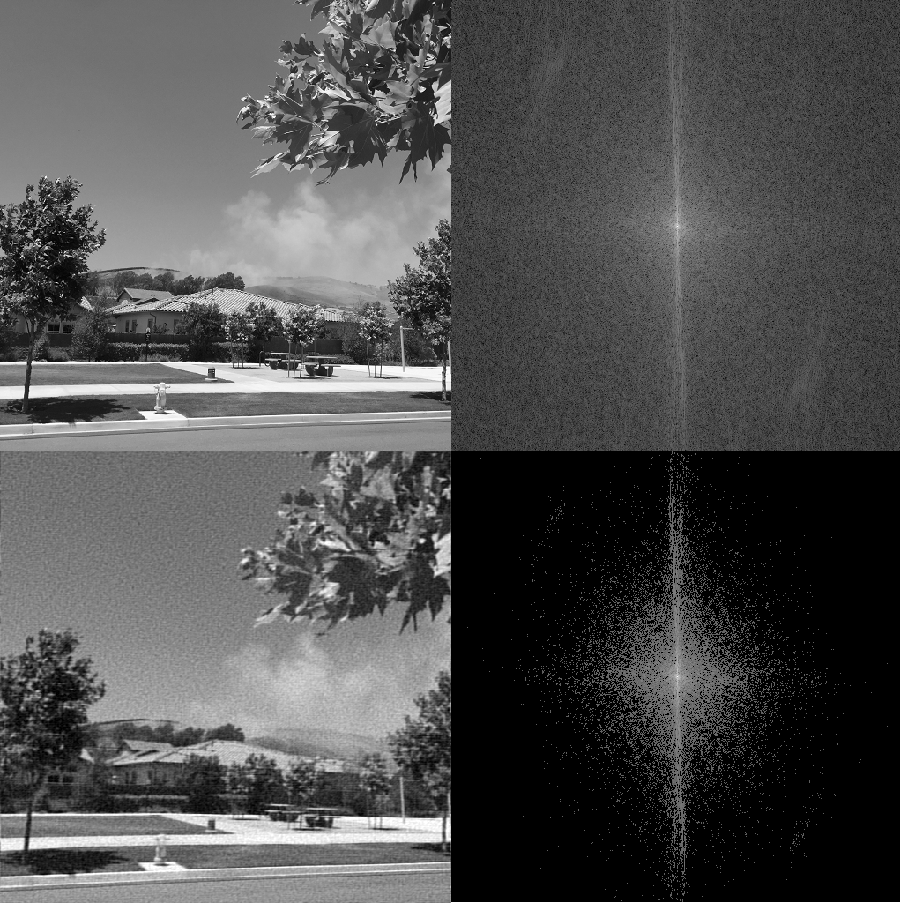

.. _application.rst:

Application
###########

L'algorithme de FFT permet une implémentation efficace des transformées de Fourrier dans de nombreux domaines. Nous allons en approfondir deux en particulier, mais notons que l'algorithme apparaît dans presque tous les domaines, essentiellement en informatique et ingénierie, mais aussi en mathématiques, où il permet par exemple la résolution d'équations différentielles ou la factorisation d'entiers. Un ami à moi, Jan Birmanns, a même mis au point un algorithme d'interpolation de courbes au moyens d'épycicles à l'aide de quaternions et de la FFT (le travail de maturité est disponible `ici <https://www.math.ch/about-sms/matura-awards/MA_JanBirmanns.pdf>`_)

Traitement de signal
====================

Dans de nombreux logiciels de traitement sonore, il est possible d'augmenter ou de baisser la hauteur d'un échantillon de son, ou alors de supprimer de bruits de fonds par exemple.

..  admonition:: Pitch Shift

    ..  figure:: figures/spectrum.gif
        :width: 80%
        :align: center
        
        Déplacement des fréquences.

    De façon intuitive, il suffit de déplacer les différentes fréquences vers le haut ou le bas pour augmenter ou diminuer la hauteur globale du son. L'application de la FFT est alors évidente, il suffit donc de produire le spectre du morceau à analyser, puis de déplacer les différentes fréquences au souhait. (Plus précisément, il s'agit d'une homotéthie complexe :math:`f(z) = az` pour un facteur :math:`a`, et non pas d'une translation.)
    
    Les auto-tuners fonctionnent de façon similaire : le spectre du son est comparé au fréquences de rapports entiers ou de moitiée des notes de la gamme naturelle, afin de rendre le son mélodieux.

..  admonition:: Réduction de bruit

    ..  figure:: figures/noise.jpg
        :width: 100%
        :align: center
        
        Détection et réduction de bruit.
    
    On appel bruit les fréquences supplémentaires qui viennent perturber le son original. Dans notre cas, nous simplifions le signal à une harmonique. La FFT permet alors d'identifier les fréquences perturbatrices, et le signal est lissé par la suppression de ces bruits parasites. Dans des cas complexes, on peut par exemple réduire le bruit du vent dans une vidéo.

Compression d'images
====================

La FFT ne se limite pas qu'aux ondes sonores, mais peut aussi être utilisée pour les images. On represente alors des ondes spatiales planes. L'intensité de la fréquence donne alors l'intensité du ton de gris ajouté. La superposition de ces ondes permet alors une représentation de l'image.

        
    Cet exemple montre bien le fonctionnement de la décomposition. Les ondes (représentées par des nombres complexes dans le plan) permettent l'émergence de patterns.

Les ondes avec de petites fréquences se trouvent au centre du spectre, et donnent les grandes lignes de l'image finale, tandis que les bords relèvent d'une importance moindre. Puisque leur ajout est souvent négligeable à l'oeil humain, on préfère économiser de la place au stockage de l'image en supprimant l'information superflue:

    La réduction du nombre de fréquences représentées est souvent invisible pour l'humain.

Ce genre de processus est utilisé pour les fichiers jpg, par exemple, ou de manière équivalente sur les sons, pour compresser les fichiers sonores, comme dans MP4.
