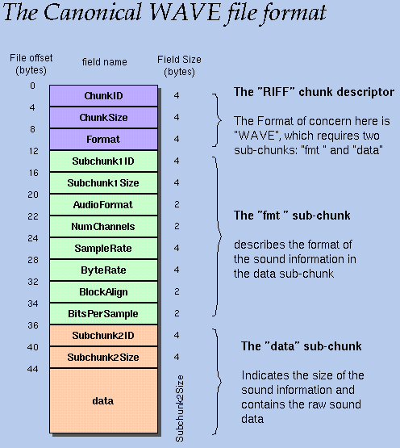
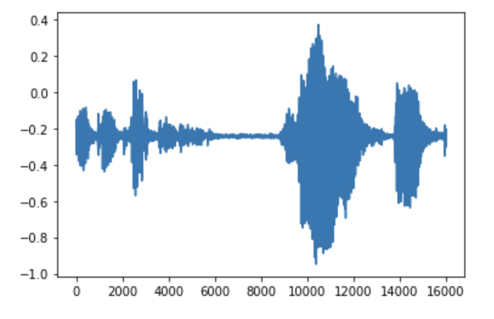

.. _exemple.rst:

Exemple d'utilisation
#####################

Nous montrons ici une implémentation simple et brève de la FFT pour obtenir le spectre d'un échantillon sonore.

..  literalinclude:: scripts/spectre_son.py
    :linenos:
    :emphasize-lines: 13,14,25

Cet implémentation prend le fichier avec le chemin __file__ et le nom 'sample.wav'. Ici, le spectre est limité au canal gauche pour simplification (il s'agit du canal 0, et donc  aussi du seul canal si le son est enregistré en mono.)

Un fichier .wav se décompose comme suit:

        
    Les bytes placés entre les 24 et 28 premiers bytes du fichier donnent la fréquence de l'échantillon. Ceux-ci permettent alors de donner les écarts temporels des différentes intensitées données dans la partie 'data' (du 44ème byte jusqu'à la fin).

Numpy et Scipy automatisent la récupération des données et effectuent la FFT sur la liste 'data' (on aurait pu récupérer l'implémentation présentée auparavant si l'on le souhaitait). Puis, la bibliothèque PyPlot permet un affichage agréable et dynamique du spectre ainsi obtenu.

    Exemple d'affichage du spectre avec PyPlot

..  admonition:: Le saviez-vous ?

    Dans de nombreuses effets musicaux apparaît un graphe qui s'agite au fil de la musique. Il s'agit en général du spectre du son, pris sur des échantillons relativement courts, la hauteur indiquant l'intensité. Cela permet une visualisation du son et rend l'experience visuelle. La FFT est même artistique, en quelque sorte !

    ..  figure:: figures/cool.jpg
        :width: 80%
        :align: center