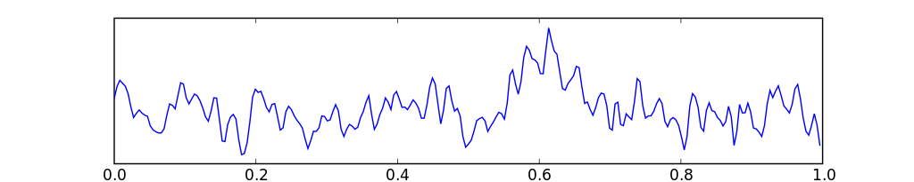
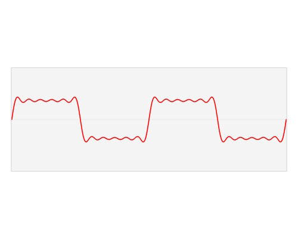

.. _introduction.rst:

Introduction
############

Considérons un patient insomniaque :math:`P` se rendant à l'hôpital pour effectuer une électroencéphalographie. Plusieurs électrodes seront placées sur son crâne, et après avoir passé une nuit en clinique, les médecins sauront lui trouver un remède à ses troubles du sommeil.

Le cerveau est le siège d'une intense activité électrique. On distingue plusieurs régions et niveaux d'activités différents qui produisent chacuns des fréquences électriques différentes. Ainsi, le signal final est un méli-mélo de superposition de fréquences et intensités électriques différentes : comment alors séparer les informations ?

    
    Electroencéphalographie d'une seconde

Appelons :math:`f(t)` la fonction réelle décrivant cette courbe. Nous admettons de pouvoir décomposer notre signal avec une série de Fourier :

.. math::
  
  f(t) = \sum_{n=1}^\infty \left(a_n\cdot \cos(nt)+b_n \cdot \sin(nt)\right)

Cela signifie que la fonction :math:`f` se laisse écrire comme la superposition de fonctions harmoniques.

..  admonition:: Info
    
    Une fonction harmonique est, dans notre contexte simplifié, une fonction sinusoïdale (:math:`\sin, \cos`) dont l'argument est multiplié par un nombre entier.

    .. math::

      \sin(2x), \cos(30x), \sin(6x)

    sont pour l'exemple des fonctions harmoniques.

Nous disons donc que n'importe quel signal peut être écrit comme une somme de plusieurs sinus et cosinus harmoniques, multipliés par un coefficient qui leur propre. Certaines fonctions harmoniques apportent une contribution plus importante que d'autres pour construire le signal, et le mélange parfait est alors égal au signal.

    Decomposition d'un signal à l'aide de Fourier

Le gif précédent permet une représentation intuitive du fonctionnement de la décomposition. Les barres montrées à la fin de l'animation correspondent aux coefficients :math:`c_n` de la forme exponentielle (détaillée dans la section suivante), et permettent de simplifier la notation en passant de deux coefficients à un seul.

Le graphe des barres permet une représentation dite *spectrale* (notée :math:`\hat{f}`), alternaltivement à une représentation *temporelle* à la quelle nous sommes habitués : on représente les contributions des différentes fonctions harmoniques plutôt que leur somme. 

..  warning::
    
    Il est important de noter que les deux graphes portent l'exacte même information, simplement représentée différemment.

Grâce à plusieurs méthodes que nous allons aborder dans la suite, il est possible de retrouver les coefficients à partir du signal entier. Ceci permet par exemple aux médecins de différencier les différentes ondes. Les ondes *delta* correspondent aux harmoniques de moins de 4, les ondes *theta* aux harmoniques 4 à 8 etc. Ceci permet au médecin d'ensuite analyser les différentes parties du cerveau sans avoir à placer un dispositif compliqué.

.. admonition:: Vocabulaire

  La **série de Fourier** correspond à la somme des harmoniques multipliées avec leurs coefficients. Il est important de note que la série de Fourier correspondante peine parfois à converger vers la fonction voulue.

